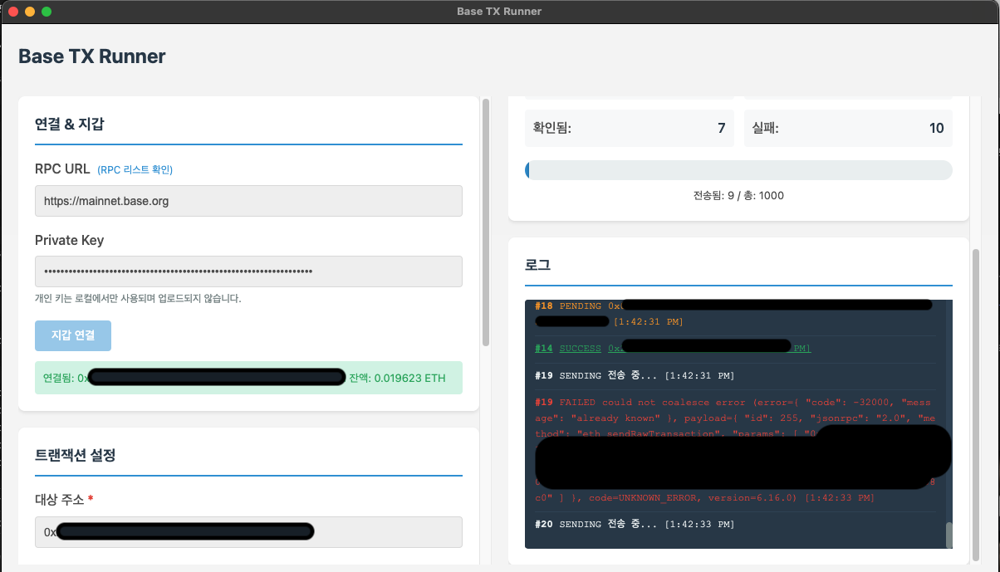

# Base TX Runner



Base 체인에서 대량의 저렴한 트랜잭션을 전송하기 위한 Electron 데스크톱 애플리케이션입니다.

## 기능

- **지갑 연결**: RPC URL과 Private Key를 사용하여 Base 네트워크에 연결
- **트랜잭션 설정**: 대상 주소, 트랜잭션 수, Gas 가격 등 설정
- **대량 전송**: 최대 2000개의 트랜잭션을 안전하게 전송
- **실시간 상태**: 전송 진행 상황, 성공/실패 통계 실시간 표시
- **로그**: 각 트랜잭션의 상태를 추적하고 Basescan에서 확인 가능

## 설치 및 실행

### 1. 의존성 설치

```bash
npm install
```

### 2. 애플리케이션 실행

```bash
npm start
```

개발 모드 (DevTools 포함):

```bash
npm run dev
```

## 빌드

### 빌드 도구 설치

프로젝트는 `electron-builder`를 사용하여 배포용 실행 파일을 생성합니다.

```bash
npm install
```

### 빌드 명령어

#### 전체 플랫폼 빌드

현재 플랫폼에 맞는 실행 파일 생성:

```bash
npm run build
```

또는

```bash
npm run dist
```

#### 플랫폼별 빌드

**macOS 빌드:**

```bash
npm run build:mac
```

생성 파일: `dist/Base TX Runner-1.0.0.dmg`, `dist/Base TX Runner-1.0.0-mac.zip`

**Windows 빌드:**

```bash
npm run build:win
```

생성 파일: `dist/Base TX Runner Setup 1.0.0.exe`, `dist/Base TX Runner-1.0.0-win.exe` (portable)

**Linux 빌드:**

```bash
npm run build:linux
```

생성 파일: `dist/Base TX Runner-1.0.0.AppImage`, `dist/base-tx-runner_1.0.0_amd64.deb`

#### 모든 플랫폼 빌드

```bash
npm run build:all
```

### 빌드 출력

빌드된 파일은 `dist/` 디렉토리에 생성됩니다.

- **macOS**: `.dmg` (설치 파일), `.zip` (압축 파일)
- **Windows**: `.exe` (NSIS 설치 파일), `.exe` (portable 실행 파일)
- **Linux**: `.AppImage` (실행 파일), `.deb` (Debian 패키지)

### 빌드 설정

빌드 설정은 `package.json`의 `build` 섹션에서 수정할 수 있습니다:

- `appId`: 애플리케이션 고유 ID
- `productName`: 빌드된 앱의 이름
- `directories.output`: 빌드 출력 디렉토리
- `files`: 빌드에 포함할 파일 목록

## 자동 릴리즈 (GitHub Actions)

프로젝트는 GitHub Actions를 사용하여 자동으로 빌드하고 릴리즈를 생성합니다.

### 설정 방법

1. **GitHub 레포지토리 설정**

   `package.json`의 `build.publish` 섹션에 GitHub 레포지토리 정보를 추가하세요:

   ```json
   "publish": {
     "provider": "github",
     "owner": "your-username",
     "repo": "baseSendBot"
   }
   ```

2. **자동 릴리즈 트리거**

   릴리즈는 다음 두 가지 방법으로 트리거됩니다:

   - **태그 푸시**: `v`로 시작하는 태그를 푸시하면 자동으로 빌드 및 릴리즈가 생성됩니다.
   - **수동 실행**: GitHub Actions 탭에서 워크플로우를 수동으로 실행할 수 있습니다.

### 릴리즈 생성 방법

#### 방법 1: 태그를 통한 자동 릴리즈

```bash
# 버전 업데이트 (package.json의 version 수정)
npm version patch  # 0.0.1 -> 0.0.2
# 또는
npm version minor  # 0.0.1 -> 0.1.0
# 또는
npm version major  # 0.0.1 -> 1.0.0

# 태그 푸시
git push --follow-tags
```

또는 수동으로 태그 생성:

```bash
git tag v0.0.1
git push origin v0.0.1
```

#### 방법 2: 수동 실행

1. GitHub 레포지토리로 이동
2. "Actions" 탭 클릭
3. "Build and Release" 워크플로우 선택
4. "Run workflow" 버튼 클릭
5. 브랜치 선택 후 실행

### 릴리즈 파일

릴리즈가 생성되면 다음 파일들이 GitHub Releases에 업로드됩니다:

- **macOS**: `.dmg`, `.zip`
- **Windows**: `.exe` (NSIS 설치 파일), `.exe` (portable)
- **Linux**: `.AppImage`, `.deb`

### 주의사항

- GitHub Actions는 `GITHUB_TOKEN`을 자동으로 제공하므로 별도의 토큰 설정이 필요 없습니다.
- 태그 이름은 `v`로 시작해야 합니다 (예: `v0.0.1`, `v1.0.0`).
- `package.json`의 `version`과 태그 버전이 일치하는 것이 좋습니다.

## 사용 방법

1. **지갑 연결**

   - RPC URL 입력 (기본값: `https://base.llamarpc.com`)
   - Private Key 입력
   - "지갑 연결" 버튼 클릭

2. **트랜잭션 설정**

   - 대상 주소 입력 (필수)
   - 트랜잭션 수 설정 (기본: 1000, 최대: 2000)
   - 트랜잭션당 값 설정 (기본: 0 ETH)
   - Gas 가격 설정 (기본: 0.02 gwei)
   - 트랜잭션 간 지연 시간 설정 (기본: 300ms)
   - 최대 대기 중 트랜잭션 수 설정 (기본: 5)

3. **전송 시작**

   - "전송 시작" 버튼 클릭
   - 실시간으로 진행 상황 확인
   - 필요시 "중지" 버튼으로 중단 가능

4. **결과 확인**
   - 로그에서 각 트랜잭션의 상태 확인
   - 성공한 트랜잭션 해시를 클릭하여 Basescan에서 확인

## 보안 주의사항

- **Private Key는 로컬에서만 사용되며 업로드되지 않습니다.**
- Private Key를 안전하게 관리하세요.
- 테스트 목적이 아닌 경우, 메인넷에서 사용하기 전에 충분히 테스트하세요.

## 기술 스택

- **Electron**: 데스크톱 애플리케이션 프레임워크
- **ethers.js v6**: 블록체인 상호작용
- **Vanilla JavaScript**: 프레임워크 없는 순수 JavaScript

## 프로젝트 구조

```
baseSendBot/
├── main.js              # Electron 메인 프로세스
├── preload.js           # 보안 컨텍스트 브리지
├── package.json         # 프로젝트 설정 및 의존성
├── renderer/
│   ├── index.html       # UI 구조
│   ├── styles.css       # 스타일시트
│   └── app.js           # 애플리케이션 로직
└── README.md            # 문서
```

## 주의사항

- Base 메인넷에서 실행됩니다.
- Gas 가격이 너무 낮으면 트랜잭션이 처리되지 않을 수 있습니다.
- 네트워크 상태에 따라 전송 속도가 달라질 수 있습니다.
- RPC 제공업체의 rate limit에 주의하세요.

## 라이선스

MIT
